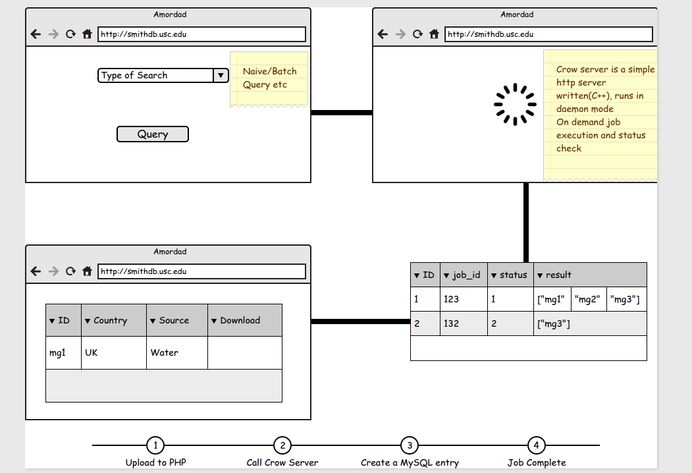

## Amordad Implementation (as of 9th Feb, 2015)

The basic design consists of two parts:

* Frontend(`AMFE`)

    This is a PHP implementation running on Apache, lets assume on port 80.

    Functionalities supported:

    - Query file upload(Search)
    - Maps based visualization for Metadata
    - A tabular result page for showing metadata, cosine value etc.

* Backend(`AMBE`)

    - Based on RESTFul [Crow](https://github.com/ipkn/crow) framework
    - Runs in daemon mode
    - All feature vectors are loaded at runtime for once and all
    - It receives requests on RESTFUL urls such as `http://localhost:8081/AMBE/naivequery/<job_id>` for running naivequery
    `<job_id>` is a unique identifier created by `AMFE` on query upload
    - Requests are run as soon as they are received, it is multithreaded and there is *NO* job queue maintained at the moment

## Future Amordad[Not finalized]

